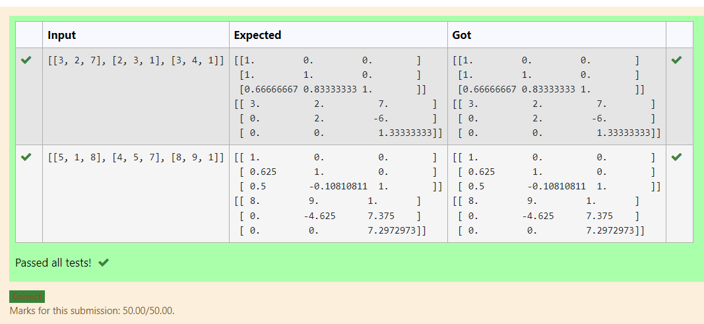
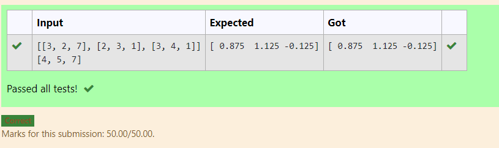

# LU Decomposition 

## AIM:
To write a program to find the LU Decomposition of a matrix.

## Equipments Required:
1. Hardware – PCs
2. Anaconda – Python 3.7 Installation / Moodle-Code Runner

## Algorithm
1. 
2. 
3. 
4. 

## Program:
(i) To find the L and U matrix
```
/*
Program to find the L and U matrix.
Developed by: Soundariyan M N
RegisterNumber:22008347 
*/
```
```python
import numpy as np
from scipy.linalg import lu
A= np.array(eval(input()))
P,L,U=lu(A)
print(L)
print(U)
```

(ii) To find the LU Decomposition of a matrix
```
/*
Developed by: Soundariyan M N
RegisterNumber:22008347 
*/
```
```python
import numpy as np
from scipy.linalg import lu_factor,lu_solve
A=np.array(eval(input()))
b=np.array(eval(input()))
lu, piv= lu_factor(A)
X= lu_solve((lu,piv), b)
print (X)
```

## Output:
 To find the L and U matrix

To find the LU Decomposition of a matrix



## Result:
Thus the program to find the LU Decomposition of a matrix is written and verified using python programming.

